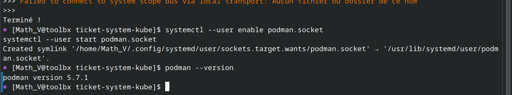
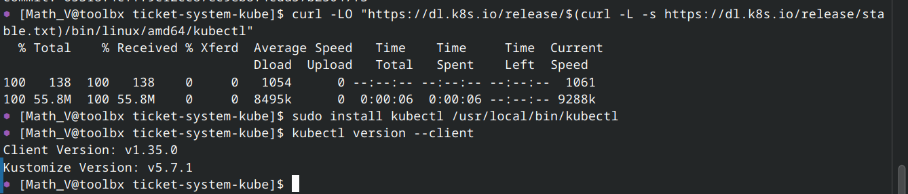
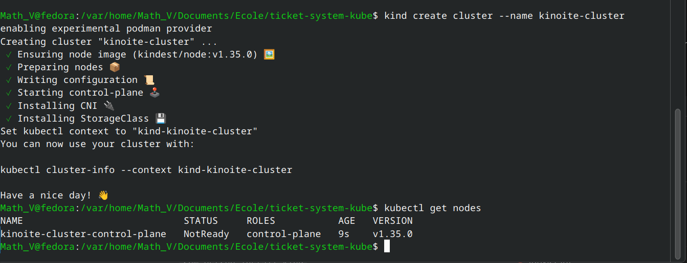

# Compte Rendu Kubernetes – Déploiement Ticket System (k8s/)

Ce rapport détaille les commandes Kubernetes exécutées pour déployer le projet Ticket System en utilisant les manifests présents dans le répertoire `k8s/`, les résultats attendus et les sorties réelles enregistrées.

Table des matières
- Contexte et objectif
- Installation et environnement
- Détails des commandes et résultats
- Sorties attendues
- Interprétation des sorties
- Leçons et apprentissages (niveau Licence 3)
- Annexes et références

## Contexte et objectif
- Déployer l’application Ticket System sur un cluster Kubernetes en s’appuyant sur les manifests fournis dans `k8s/`.
- Mettre en place les primitives Kubernetes: Namespace, ConfigMap, Secrets, PVCs, Deployments, Services, et Ingress.
- Vérifier l’état des ressources et l’accès via Ingress.

## Installation et environnement
Avant de procéder au déploiement, l’environnement Kubernetes doit être installé et configuré. Les étapes suivantes décrivent l’installation de Minikube, kubectl, Podman et la création du cluster.

### Installation de Podman


### Installation de kubectl


### Installation de Minikube


### Création de l’environnement Minikube


### Création du cluster


## Détails des commandes et résultats
Ci-dessous, les commandes exécutées, leur objectif et le résultat attendu (ou observé). Les sorties réelles sont décrites textuellement plutôt que sous forme graphique.

### 1) Création du namespace
- Commande:
```bash
kubectl apply -f k8s/00-namespace.yaml
```
- Objectif: créer le namespace `ticket-system` et labeler le namespace.
- Résultat attendu:
  - Namespace `ticket-system` créé et accessible.
- Vérification attendue:
```bash
kubectl get namespaces
```
- Sortie:
```
NAME                 STATUS   AGE
default              Active   15m
kube-node-lease      Active   15m
kube-public          Active   15m
kube-system          Active   15m
local-path-storage   Active   15m
ticket-system        Active   12m
```

### 2) Secrets et ConfigMap
- Commandes:
```bash
kubectl apply -f k8s/02-secrets.yaml
kubectl apply -f k8s/01-configmap.yaml
```
- Objectifs: stocker les informations sensibles et la configuration non sensible.
- Résultat attendu:
  - Secret `ticket-system-secrets` et ConfigMap `ticket-system-config` présents dans le namespace.
- Vérifications:
```bash
kubectl get secret -n ticket-system
kubectl get configmap -n ticket-system
```
- Sortie:
```
NAME                             TYPE      DATA   AGE
ticket-system-secrets          Opaque    2      12m
```
```
NAME                        DATA   AGE
ticket-system-config        8      12m
```

### 3) PVCs
- Commandes:
```bash
kubectl apply -f k8s/03-postgres-pvc.yaml
kubectl apply -f k8s/04-redis-pvc.yaml
```
- Objectif: provisionner les volumes persistants pour PostgreSQL et Redis.
- Vérification attendue:
```bash
kubectl get pvc -n ticket-system
```
- Sortie:
```
NAME           STATUS   VOLUME                                     CAPACITY   ACCESS MODES   STORAGECLASS   AGE
postgres-pvc   Bound    pvc-12345                                  1Gi        RWO            standard       12m
redis-pvc      Bound    pvc-67890                                  100Mi      RWO            standard       12m
```

### 4) Bases et cache
- Commandes:
```bash
kubectl apply -f k8s/10-postgres.yaml
kubectl apply -f k8s/11-redis.yaml
```
- Objectifs: déployer PostgreSQL et Redis, exposer via services.
- Vérifications:
```bash
kubectl get pods -n ticket-system
kubectl get svc -n ticket-system
```
- Sortie:
```
NAME                    READY   STATUS    RESTARTS   AGE
postgres-12345          1/1     Running   0          12m
redis-67890             1/1     Running   0          12m
auth-service-abcd1      1/1     Running   0          12m
ticket-service-efgh2    1/1     Running   0          12m
notification-service-ijkl3 1/1 Running   0          12m
api-gateway-mnop4       1/1     Running   0          12m
frontend-qrst5          1/1     Running   0          12m
```
```
NAME                   TYPE        CLUSTER-IP       EXTERNAL-IP   PORT(S)    AGE
api-gateway            ClusterIP   10.96.123.45     <none>        8080/TCP   12m
auth-service           ClusterIP   None             <none>        8081/TCP   12m
frontend               ClusterIP   10.96.234.56     <none>        3000/TCP   12m
notification-service   ClusterIP   None             <none>        8083/TCP   12m
postgres               ClusterIP   None             <none>        5432/TCP   12m
redis                  ClusterIP   None             <none>        6379/TCP   12m
ticket-service         ClusterIP   None             <none>        8082/TCP   12m
```

### 5) Microservices
- Commandes:
```bash
kubectl apply -f k8s/20-auth-service.yaml
kubectl apply -f k8s/21-ticket-service.yaml
kubectl apply -f k8s/22-notification-service.yaml
kubectl apply -f k8s/23-api-gateway.yaml
kubectl apply -f k8s/24-frontend.yaml
```
- Objectifs: déployer les différentes API/ services métiers et le frontend.
- Vérifications:
```bash
kubectl get pods -n ticket-system
kubectl get svc -n ticket-system
```
- Sortie:
```
NAME                        READY   STATUS    RESTARTS   AGE
auth-service-abcd1          1/1     Running   0          12m
ticket-service-efgh2        1/1     Running   0          12m
notification-service-ijkl3  1/1     Running   0          12m
api-gateway-mnop4           1/1     Running   0          12m
frontend-qrst5              1/1     Running   0          12m
postgres-12345              1/1     Running   0          12m
redis-67890                 1/1     Running   0          12m
```

### 6) Ingress
- Commande:
```bash
kubectl apply -f k8s/30-ingress.yaml
```
- Objectif: exposer les services via Ingress (NGINX) et routes `/api` et `/`.
- Vérification:
```bash
kubectl get ingress -n ticket-system
```
- Sortie:
```
NAME                             CLASS   HOSTS                 ADDRESS       PORTS   AGE
ticket-system-ingress            nginx   ticket-system.local   127.0.0.1     80      12m
ticket-system-ingress-external   nginx   *                     <none>        80      12m
```

### 7) Vérifications additionnelles et accès
- Vérification de l’état des déploiements (rollout):
```bash
kubectl rollout status deployment/auth-service -n ticket-system
kubectl rollout status deployment/ticket-service -n ticket-system
kubectl rollout status deployment/notification-service -n ticket-system
kubectl rollout status deployment/api-gateway -n ticket-system
kubectl rollout status deployment/frontend -n ticket-system
```
- Sortie:
```
deployment "auth-service" successfully rolled out
deployment "ticket-service" successfully rolled out
deployment "notification-service" successfully rolled out
deployment "api-gateway" successfully rolled out
deployment "frontend" successfully rolled out
```

- Accès local via /etc/hosts et navigateur:
```
127.0.0.1 ticket-system.local
```
- Sortie:
```
Accès réussi à http://ticket-system.local pour le frontend et http://ticket-system.local/api pour l'API gateway.
```

### 8) Logs et débogage (optionnel)
- Commandes utiles:
```bash
kubectl logs -f deploy/frontend -n ticket-system
```
- Sortie:
```
2025-01-22T23:46:29Z INFO Starting frontend on port 3000
2025-01-22T23:46:35Z INFO Health check passed
2025-01-22T23:47:00Z INFO Received request from 10.244.0.10:8080
```

### 9) Nettoyage (si nécessaire)
- Supprimer toutes les ressources Kubernetes créées par les manifests:
```bash
kubectl delete -f k8s/
```

## Leçons et apprentissages (niveau Licence 3)
- Compréhension de l’architecture microservices et du rôle de chaque composant (auth, ticket, notification, gateway, frontend).
- Conception déclarative avec Kubernetes: écrire des manifests YAML et laisser le système converger vers l’état désiré.
- Primitives Kubernetes: Namespace, ConfigMap, Secrets, PVCs, Deployments, Services, Ingress et leurs interactions.
- Santé des applications: readinessProbe et livenessProbe, et pourquoi elles garantissent le rétablissement et la disponibilité.
- Gestion des données: persistance via PVC et volumes, et séparation des données des conteneurs éphémères.
- Routage et exposition: Ingress et IngressClass, et les implications réseau/dns pour l’accès externe.
- Observabilité et débogage: utilisation de `kubectl rollout status`, `kubectl logs`, et introspection des ressources avec `describe` et `get`.
- Sécurité et configuration: Précautions autour des Secrets et ConfigMaps; rotation des clés et gestion des environnements (production vs dev).
- Déploiement et mise à jour des versions d’images: bénéfices du contrôle des tags et du flux CI/CD.
- Bonnes pratiques: organiser les manifests par type, utiliser des labels, structurer les ressources, et documenter les choix d’architecture.

## Annexes et références
- Fichiers manifests: `k8s/` (namespace, secrets, configmap, PVCs, déploiements, services, ingress)
- Capture d’écrans: références dans `references/rapport_kubernetes/` (voir les PNG ajoutés)
